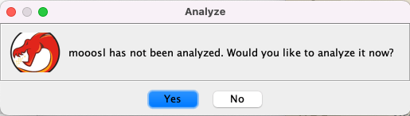
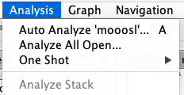

# Running the Mooosl Demo

This demo walks through running the analysis pass via the UI on the mooosl CTF challenge.
The goal is to automatically infer and apply the linked list type to the global variable and functions that operate over it. These directions assume the user already has BTIGhidra installed in a running Ghidra instance. For installation directions please refer to the [README](README.md)


## Challenge Introduction

Mooosl is a CTF challenge that features a use-after-free. The challenge binary is located in `./binary_type_inference/test_data/mooosl` and the source for the challenge is located in `./binary_type_inference/test_data/mooosl_source/`.

The binary presents this menu:


 

Each of the functions `store`, `query`, and `delete` manipulate a hashmap like data structure:

```c
struct node {
    uint8_t *key;
    uint8_t *value;
    size_t key_size;
    size_t value_size;
    uint64_t hash;
    struct node *next;
    // struct node *prev;
};


static struct node *list_heads[HASH_SIZE];
```

The delete function contains a buggy condition causing an element to remain on the linked list if it is the last element on the list, but the element will be freed.

For this demo we aren't interested in the bug but rather utilizing type inference to improve the initial decompilation/reverse engineering of the target.

## Inferring Moool's Linked List Type

### Importing the binary:

Import the binary `./binary_type_inference/test_data/mooosl` into a Ghidra project like normal (File->Import File). Default import options are sufficient, but enable Decompiler Parameter ID after clicking yes in the analysis prompt.




### Exploring the Binary

To prove that the inference algorithm is actually doing something, feel free to explore the binary at this time. 

To save some time here is a table of function address to function name.

| Function Address | Function Name |
|----------------- | ------------- |
| FUN_001015a4     | store         |
| FUN_00101672     | query         |
| FUN_0010171b     | delete        |
| FUN_001014fb     | lookup        |    

For now we will focus on the lookup function.

The original decompilation is reproduced below
```c
void ** FUN_001014fb(void *param_1,void *param_2)

{
  int iVar1;
  ulong uVar2;
  void **local_18;
  
  uVar2 = FUN_001013db((long)param_1,(ulong)param_2);
  local_18 = *(void ***)(&DAT_00104040 + (ulong)((uint)(void *)(uVar2 & 0xffffffff) & 0xfff) * 8);
  while( true ) {
    if (local_18 == (void **)0x0) {
      return (void **)0x0;
    }
    if ((((void *)(uVar2 & 0xffffffff) == local_18[4]) && (param_2 == local_18[2])) &&
       (iVar1 = memcmp(param_1,*local_18,(size_t)param_2), iVar1 == 0)) break;
    local_18 = (void **)local_18[5];
  }
  return local_18;
}
```

Note the poor types for the function. The function takes two `void*` parameters and returns a `void**`. The field accesses are typed as array accesses. The original C is reproduced below:

```c
static struct node *lookup(const uint8_t *key, size_t key_size)
{
    uint64_t h = key_hash(key, key_size);
    for (struct node *n = list_heads[h & HASH_MASK]; n; n = n->next) {
        if (n->hash == h && n->key_size == key_size && !memcmp(key, n->key, key_size)) {
            return n;
        }
    }
    return NULL;
}
```

### Running Type Inference

To run the type inference pass open the `Analysis` menu and click `Auto Analyze 'mooosl'`.



Enable the checkbox next to `Type Inference` if you would like to save debug output to `/tmp` you can also check `Save to debug directory` in the `Type Inference` analysis options (Note: this will currently throw an exception on systems without /tmp). 


Click `Analyze`