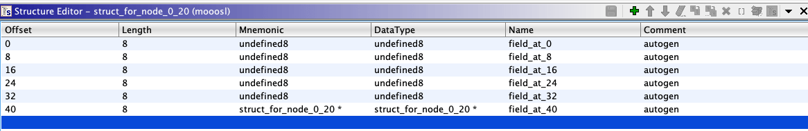

# Running the Mooosl Demo

This demo walks through running the analysis pass via the UI on the [mooosl CTF challenge](https://github.com/o-o-overflow/dc2021q-mooosl).
The goal is to automatically infer and apply the linked list type to the global variable and functions that operate over it. These directions assume the user already has BTIGhidra installed in a running Ghidra instance. For installation directions please refer to the [README](README.md)


## Challenge Introduction

Mooosl is a CTF challenge that features a use-after-free. The challenge binary is located in `./binary_type_inference/test_data/mooosl` and the source for the challenge is located in `./binary_type_inference/test_data/mooosl_source/`.

The binary presents this menu:


 

Each of the functions `store`, `query`, and `delete` manipulate a hashmap like data structure:

```c
struct node {
    uint8_t *key;
    uint8_t *value;
    size_t key_size;
    size_t value_size;
    uint64_t hash;
    struct node *next;
    // struct node *prev;
};


static struct node *list_heads[HASH_SIZE];
```

The delete function contains a buggy condition causing an element to remain on the linked list if it is the last element on the list, but the element will be freed.

For this demo we aren't interested in the bug but rather utilizing type inference to improve the initial decompilation/reverse engineering of the target.

## Inferring Moool's Linked List Type

### Importing the binary:

Import the binary `./binary_type_inference/test_data/mooosl` into a Ghidra project like normal (File->Import File). Default import options are sufficient, but enable Decompiler Parameter ID after clicking yes in the analysis prompt.


Running Decompiler Parameter ID is important because the current type inference algorithm relies on a priori knowledge of where parameters for a given function are stored. 

### Exploring the Binary

To prove that the inference algorithm is actually doing something, feel free to explore the binary at this time. 

To save some time here is a table of function address to function name.

| Function Address | Function Name |
| ---------------- | ------------- |
| FUN_001015a4     | store         |
| FUN_00101672     | query         |
| FUN_0010171b     | delete        |
| FUN_001014fb     | lookup        |
| FUN_00101436     | value_dump    |

For now we will focus on the lookup function.

The original decompilation is reproduced below
```c
void ** FUN_001014fb(void *param_1,void *param_2)

{
  int iVar1;
  ulong uVar2;
  void **local_18;
  
  uVar2 = FUN_001013db((long)param_1,(ulong)param_2);
  local_18 = *(void ***)(&DAT_00104040 + (ulong)((uint)(void *)(uVar2 & 0xffffffff) & 0xfff) * 8);
  while( true ) {
    if (local_18 == (void **)0x0) {
      return (void **)0x0;
    }
    if ((((void *)(uVar2 & 0xffffffff) == local_18[4]) && (param_2 == local_18[2])) &&
       (iVar1 = memcmp(param_1,*local_18,(size_t)param_2), iVar1 == 0)) break;
    local_18 = (void **)local_18[5];
  }
  return local_18;
}
```

Note the poor types for the function. The function takes two `void*` parameters and returns a `void**`. The field accesses are typed as array accesses. The original C is reproduced below:

```c
static struct node *lookup(const uint8_t *key, size_t key_size)
{
    uint64_t h = key_hash(key, key_size);
    for (struct node *n = list_heads[h & HASH_MASK]; n; n = n->next) {
        if (n->hash == h && n->key_size == key_size && !memcmp(key, n->key, key_size)) {
            return n;
        }
    }
    return NULL;
}
```

### Running Type Inference

To run the type inference pass open the `Analysis` menu and click `Auto Analyze 'mooosl'`.


Enable the checkbox next to `Type Inference` if you would like to save debug output to `/tmp` you can also check `Save to debug directory` in the `Type Inference` analysis options (Note: this will currently throw an exception on systems without /tmp). 


Click `Analyze` and wait for the progress bar to finish.


Lookup's decompilation should update to:
```c
struct_for_node_0_20 * FUN_001014fb(void *param_1,size_t param_2)

{
  int iVar1;
  ulong uVar2;
  struct_for_node_0_20 *local_18;
  
  uVar2 = FUN_001013db(param_1,param_2);
  local_18 = (&PTR_00104040)[(uint)(uVar2 & 0xffffffff) & 0xfff];
  while( true ) {
    if (local_18 == (struct_for_node_0_20 *)0x0) {
      return (struct_for_node_0_20 *)0x0;
    }
    if ((((uVar2 & 0xffffffff) == local_18->field_at_32) && (param_2 == local_18->field_at_16)) &&
       (iVar1 = memcmp(param_1,(void *)local_18->field_at_0,param_2), iVar1 == 0)) break;
    local_18 = local_18->field_at_40;
  }
  return local_18;
}
```

Right clicking the `struct_for_node_0_20` and selecting `Edit Datatype` should open the data type window:




The struct definitions reveals that all 6 fields are recovered. Not all 6 fields are accessed in lookup, demonstrating interprocedural inference.

For instance the delete function allows us to observe an access to the field at 24:
```c
undefined FUN_00101672(void)

{
  long in_FS_OFFSET;
  void *local_28;
  undefined8 local_20;
  struct_for_node_0_20 *local_18;
  long local_10;
  
  local_10 = *(long *)(in_FS_OFFSET + 0x28);
  local_28 = (void *)0x0;
  local_20 = FUN_001012ed((undefined *)&local_28);
  local_18 = FUN_001014fb(local_28,local_20);
  if (local_18 == (struct_for_node_0_20 *)0x0) {
    puts("err");
  }
  else {
    FUN_00101436(local_18->field_at_8,local_18->field_at_24);
    puts("ok");
  }
  free(local_28);
  if (local_10 != *(long *)(in_FS_OFFSET + 0x28)) {
                    /* WARNING: Subroutine does not return */
    __stack_chk_fail();
  }
  return 0;
}
```

### Refining the Structure with a Known Function Signature

BTIGhidra can preserve and propogate user defined type signatures to improve its output. Note in the above structure definition we have not observed primitive types for the recovered fields. 

We are going to insert a signature for `value_dump` to refine two fields of the target structure.

Looking at the source for the challenge the signature of `value_dump` is: `void value_dump(const uint8_t *data, size_t size)` since Ghidra doesn't apply constant pointers we will apply the signature `void value_dump(uint8_t *data, size_t size)` to `FUN_00101436`. Open the function `FUN_00101436` and right click the function name and click `Edit Function Signature`.


Click ok and select the types from the generic clib. 

Now rerun type analysis by opening the auto analysis menu, checking `Type Inference` if it is not already checked and then clicking `Analyze`.

After type analysis has finished go back to `FUN_001014fb` and open the data type editor returned from lookup. Now you should see that the primitive types recovered as shown below:


The value_dump callsite's type effect in query is succesfully propogated down to the usage of the global in lookup.


### A Note on Global Variables

Ghidra does not currently have a strong notion of global variables or global variable types. To simulate global variable types we create a data type at the address of the global with the type of the global. This artifact can be observed by double clicking on `PTR_00104040` in the lookup function.

This action will jump the listing window to the address of the global:

The below image shows how the type is inserted to hint to the decompiler that usages of this address are of type `struct_for_node_20**` (the type inserted there is `struct_for_node*` making the address itself of type `struct_for_node_20**`).


